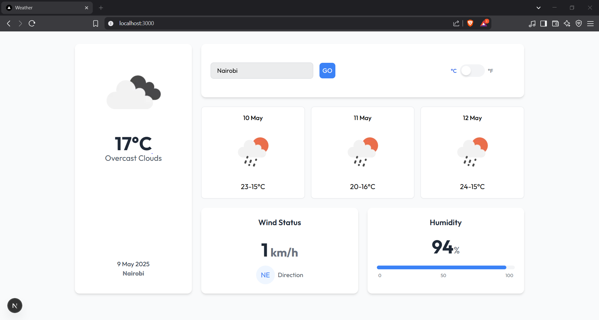

# Weather Dashboard



A responsive weather application with real-time forecasts, built using Laravel and Next.js.

---

## ✨ Features

### 🌦️ Weather Data
- Current weather conditions with icons
- 3-day forecast with min/max temperatures
- Wind speed and humidity indicators

### 🔍 Search & Settings
- City search with geocoding
- Temperature unit toggle (°C/°F)
- Fully responsive layout for all devices

---

## 🛠️ Tech Stack

| Area        | Technologies                               |
|-------------|--------------------------------------------|
| **Backend** | Laravel 12, PHP 8.2,                       |
| **Frontend**| Next.js 15, TypeScript, Tailwind CSS, Ripple UI |
| **API**     | OpenWeatherMap API                         |

---

## 🚀 Quick Start

### Prerequisites
- PHP 8.2+
- Node.js 18+
- Composer 2+
- SQLite

### Installation

1. **Clone the repository**
   ```bash
   git clone https://github.com/yourusername/weather-app.git
   cd weather-app
   ```

2. **Set up Backend**
   ```bash
   cd weather-backend
   composer install
   cp .env.example .env
   php artisan key:generate
   touch database/database.sqlite
   php artisan migrate
   ```

3. **Configure Frontend**
   ```bash
   cd ../weather-frontend
   npm install
   cp .env.local
   ```

4. **Add Your API Key**
   Get a free API key from [OpenWeatherMap](https://openweathermap.org/api) and add it to the backend environment file:
   ```bash
   echo "OPENWEATHERMAP_API_KEY=your_key_here" >> ../weather-backend/.env
   echo "OPENWEATHERMAP_GEOCODING_URL=https://api.openweathermap.org/geo/1.0/direct" >> ../weather-backend/.env
   echo "OPENWEATHERMAP_WEATHER_URL=https://api.openweathermap.org/data/2.5/weather" >> ../weather-backend/.env
   echo "OPENWEATHERMAP_FORECAST_URL=https://api.openweathermap.org/data/2.5/forecast" >> ../weather-backend/.env
   ```

5. **Run Development Servers**
   - In the backend directory:
     ```bash
     php -S localhost:8000 -t public
     ```
   - In the frontend directory:
     ```bash
     npm run dev
     ```

---

## 🔧 Configuration

### Backend (`.env`)
```ini
APP_URL=http://localhost:8000
OPENWEATHERMAP_API_KEY=your_key_here
DB_CONNECTION=sqlite
```

### Frontend (`.env.local`)
```ini
BACKEND_URL=http://localhost:8000
```

---

## 🌐 Deployment

### Laravel Backend
```bash
php artisan config:cache
php artisan route:cache
php artisan view:cache
```

### Next.js Frontend
```bash
npm run build
# Deploy the 'out' folder or connect to a Vercel project
```

---